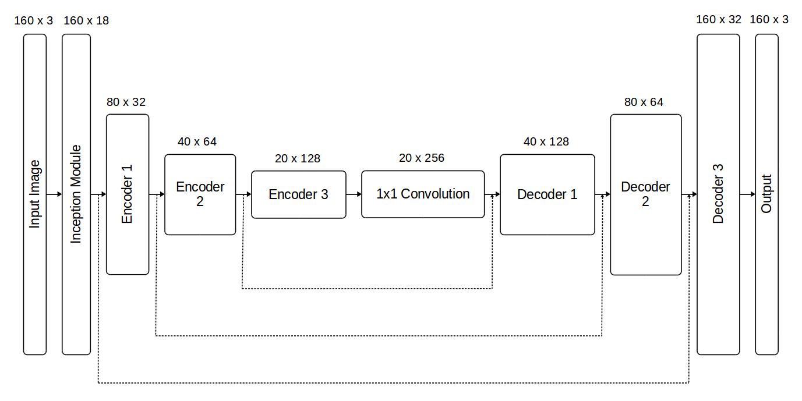
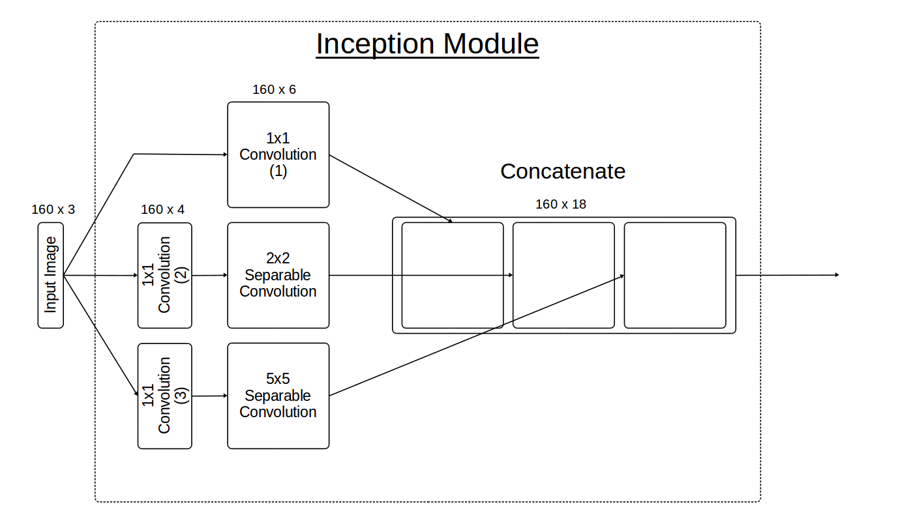
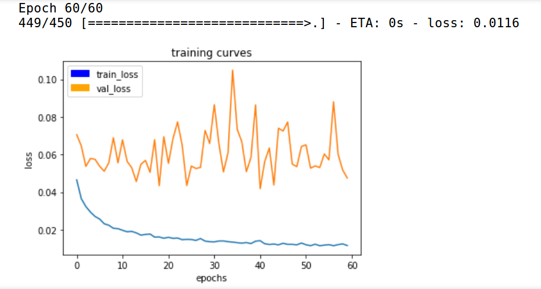
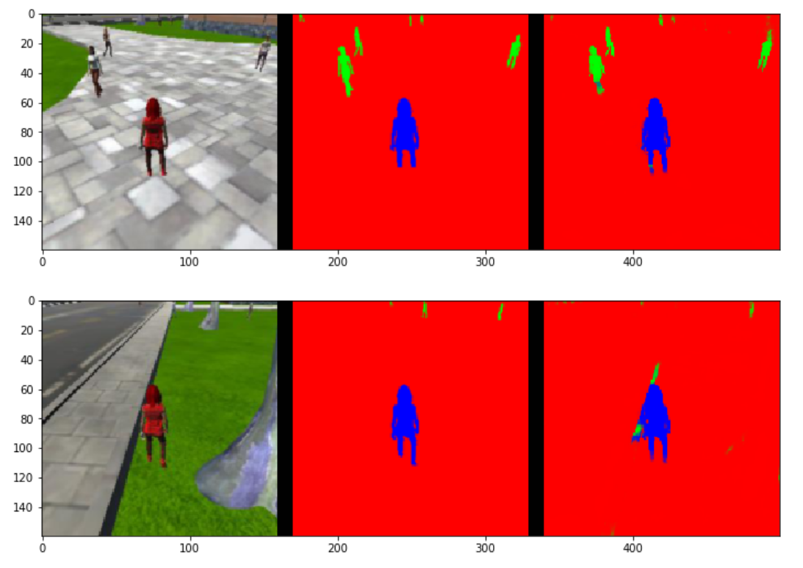
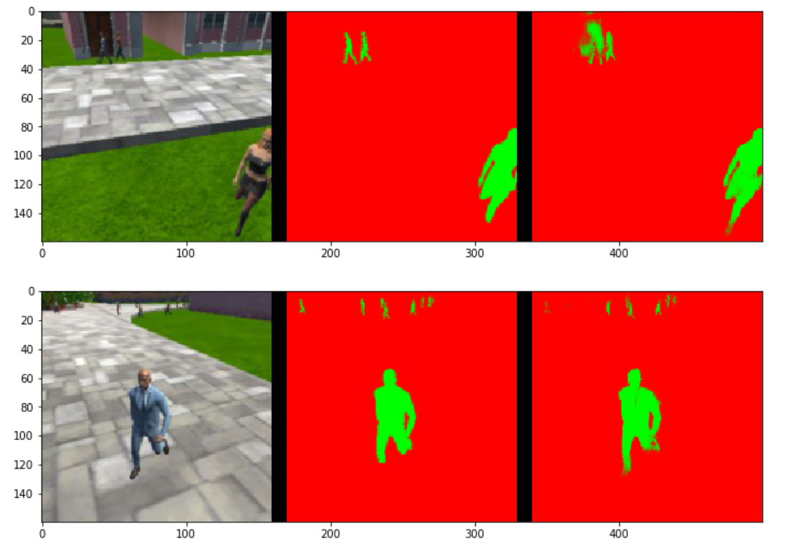
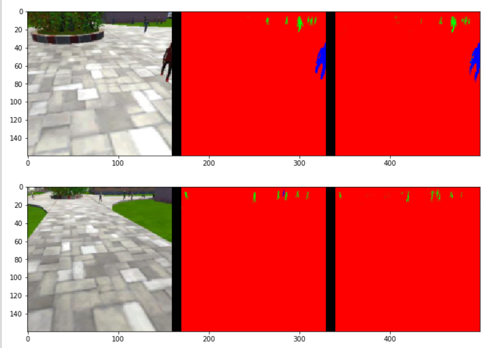

# Deep Learning Project: Semantic Segmentation 


## Required Steps for a Passing Submission:
1. Clone the project repo [here](https://github.com/udacity/RoboND-DeepLearning-Project.git).
2. Fill out the TODO's in the project code as mentioned [here](https://classroom.udacity.com/nanodegrees/nd209/parts/c199593e-1e9a-4830-8e29-2c86f70f489e/modules/cac27683-d5f4-40b4-82ce-d708de8f5373/lessons/197a058e-44f6-47df-8229-0ce633e0a2d0/concepts/b0044631-d356-4ff4-9fd9-4102c28a2efa?contentVersion=1.0.0&contentLocale=en-us). 
3. Optimize your network and hyper-parameters. 
4. Train your network and achieve an accuracy of 40% (0.40) using the Intersection over Union IoU metric which is final_grade_score at the bottom of your notebook. 
5. Make a brief writeup report summarizing why you made the choices you did in building the network.

---

## Writeup Addressing the [Rubric](https://review.udacity.com/#!/rubrics/1155/view) Points

---

The network and model training code for this project is contained within the Jupyter notebook `code/model_training.ipynb`.


### Network Architecture

**Figure 1** shows the architecture of the fully convolutional neural network (FCN) used in this project. An inception module leads into the encoder which connects to the decoder through a 1x1 convolution.  The network is *fully* convolutional because it consists of convolution layers throughout, and never includes a flat fully connected layer.  Fully connected layers are suitable for basic image classification, but do not preserve the spatial information needed for semantic segmentation, i.e., classifying each pixel in an image. The encoder and decoder contain three blocks each.  Skip connections, which provide information from higher resolution scales on the encoder side to blocks on the decoder side, are shown by dotted arrows.  Without skip connections, the predictions that the decoder is able to make after upscaling would be imprecise do to the narrow scope supplied by the encoder.  Block dimensions, (width and height) x depth, are shown above each block.

|                                                             |
|----------------------------------------------------------------------------------------|
| **Figure 1.  Diagram of the fully convolutional neural network.**|

The encoder extracts features from the image, and the decoder upscales and predicts the classification of each individual pixel.  Each encoder block consists of a 3x3 separable convolution with a stride of 2 (which halves the width and height each block).  Separable convolutions can reduce the number of parameters by more than 70% compared to regular convolutions, and consequently have the added benefit of reducing overfitting.  Each decoder block consists of:
1. Factor-of-two bilinear upsampling (which speeds up performance compared to a transposed convolution).
2. Concatenation of the upsampled input and the skip connection input.
3. A single 3x3 separable convolution of the concatenated input.  An additional separable convolution layer was tested with this FCN, but did not significantly improve accuracy gains compared to the additional computational cost.

The details of the inception module are shown in **Figure 2**.  The inception module in based on [this](https://youtu.be/SlTm03bEOxA) video, and provides full resolution information directly to the first encoder block and to the final decoder block through a skip connection.  The 1x1 and 2x2 convolutions extract fine-scale features, and the 5x5 convolution extracts larger scale features.  A 3x3 convolution was tested in place of the 2x2 and the 5x5 convolutions (in separate tests), but the scheme shown here gave better accuracy. 

|                                                       |
|----------------------------------------------------------------------------------------|
| **Figure 2.  Diagram of the inception module in the fully convolutional neural network.**|


### Hyperparameters and Training

The hyperparameters used during model training are shown in **Table 1**.

**Table 1. Hyperparameters.**

|  Parameter        | Value | Description
|-------------------|------:|-------------
| `learning_rate`   | 0.001 | optimizer learning rate
| `batch_size`      | 20    | number of images that get propagated through the network in a single pass
| `num_epochs`      | 60    | number of times the entire training dataset gets propagated through the network
| `steps_per_epoch` | 450   | number of batches of training images that go through the network in 1 epoch
| `validation_steps`| 50    | number of batches of validation images that go through the network in 1 epoch
| `workers`         | 2     | maximum number of processes to spin up

The `learning_rate` was chosen as the recommended value for the [Adam](https://machinelearningmastery.com/adam-optimization-algorithm-for-deep-learning/) optimization algorithm used for training.  The `batch_size` (number of images that get propagated through the network in a single pass) is set based on memory limitations of the GeForce GTX 1050 Ti (4 GB of memory) laptop GPU used for training.  The `num_epochs` was chosen based on practical time constraints for training, and gave a reasonably flat loss-curve towards the end of training as shown in **Figure 3**.  The `steps_per_epoch` is set to the number of images in the training dataset divided by the batch size:
```python
steps_per_epoch = 9000//batch_size # 9000 --> total number of images in training dataset
```
so that the number of images used in each epoch is equal to the total number of images in the training dataset.

|                                                                    |
|----------------------------------------------------------------------------------------|
| **Figure 3.  Loss curves for the training and validation data over 60 epochs.**|

The validation loss-curve in **Figure 3** is quite noisy, indicating that the `validation_steps` should be increased; however, a distinct increase in the validation loss-curve, representative of overfitting, is not evident. On the laptop used for training, tests showed little to no speeup by increasing the `workers` beyond 2.  Training with the settings in **Table 1.** takes 3.4 hours on the GeForce GTX 1050 Ti GPU.


### Model

The model file (`config_model_weights`) and weights HDF5 file (`model_weights`) can be found in the `data/weights` directory.

The following figures show example images of how the model performs.  The image on the left is the raw image captured by the drone camera, the image in the center is the correct classification of each pixel in the image (target: blue, pedestrian: green, background: red), and the image on the right is the predicted classification.  **Figure 4** shows sample images from the drone while following the target.  The prediction looks precise and filled in, but the bottom image shows the tendency to misclassify curbs as pedestrians.  However, this misclassification was worse before additional images with curbs was added to the training set.

|                                                        |
|----------------------------------------------------------------------------------------|
| **Figure 4.  Sample images of the model performance while following the target.**|

**Figure 5** shows sample images while the drone is patrolling without seeing the target.  Pedestrians are identified and filled in, but the top image shows that the model is confused by the door behind the top left pedestrian.  Very few, if any, training images included this door, and the predictions around it would likely improve if such images were added to the training set. 

|                                                   |
|----------------------------------------------------------------------------------------|
| **Figure 5.  Sample images of the model performance while patroling without seeing the target.**|

**Figure 6.** shows sample images while the drone is patrolling and sees the target.  As shown on the top, the model does well at predicting the target if it is within a moderate distance; however, the bottom image shows that from long distances the model identifies the target as a person, but can not distinguish that it is the target.  Honestly, I can not confidently tell that it is the target either.  The majority of training images included the target at moderate to close range, and classification at long range may improve from including more long range target images.

|                                                      |
|----------------------------------------------------------------------------------------|
| **Figure 6.  Sample images of the model performance while patroling and seeing the target.**|

This model has proven capable of identifying and segmenting the target, pedestrians, and background in this simulated environment.  It might even work on a different target, as long as it was human and very red, but different images and model training would be needed to follow another object, such as a dog or car, since this model has not learned anything about these other objects.

There are a number of scoring metrics based on images from three scenarios: following behind the target, the target is not visible, and the target is far away.  The complete set of scores can be seen in the notebook; however, the final score given below is a measure of the models overall performance.  First, the mean intersection over union (IoU) for images when the quad is following the target or the target is far away is determined (`final_IoU`).  Then a weight is calculated based on all the true positives, false positives, and false negatives for detecting the target:
```python
weight = true_pos/(true_pos+false_neg+false_pos)
```
The final score is found by multiplying the `final_IoU` by the `weight`:
```python
final_score = final_IoU * weight
```
The current model has the final grade score, or accuracy, of 0.49 which exceeds the 0.40 minimum requirement for this project.

**Final Score: 0.49**


### Future Enhancments

To improve the accuracy of this model, more images can be added to the training set that include scenarios the model still struggles with like curbs, doors, and far away targets.  Increasing the `validation_steps` so that the validation loss-curve is smoother, and then letting the training run until overfitting begins to be detected might also improve the accuracy.
